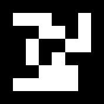
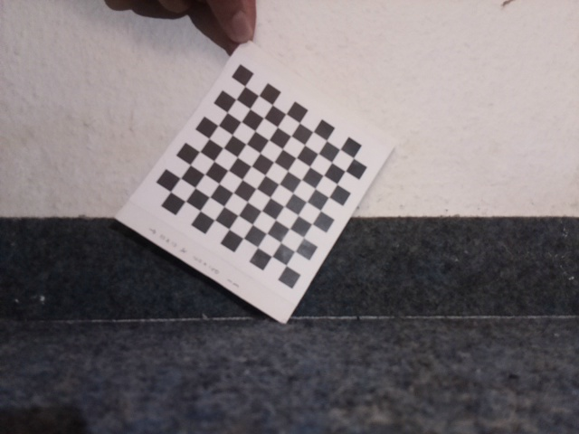
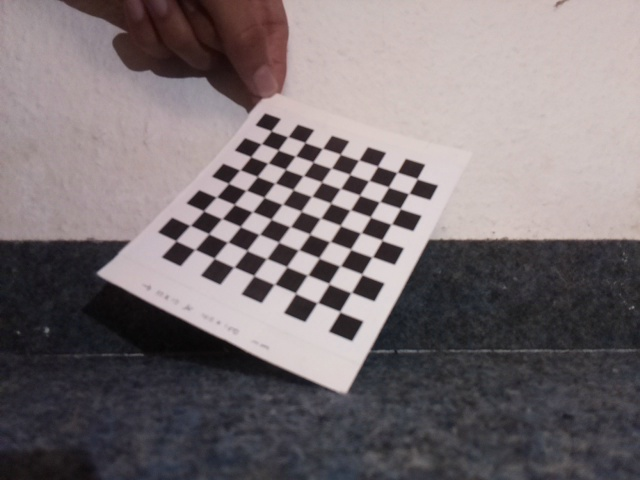
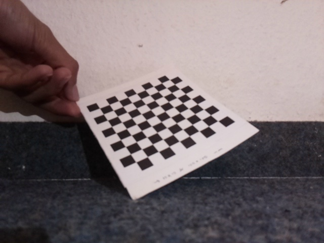
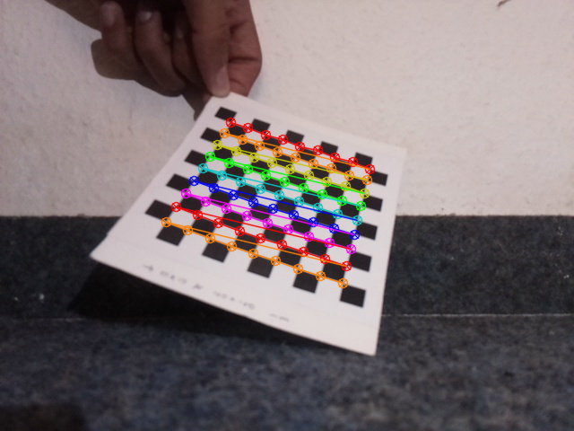
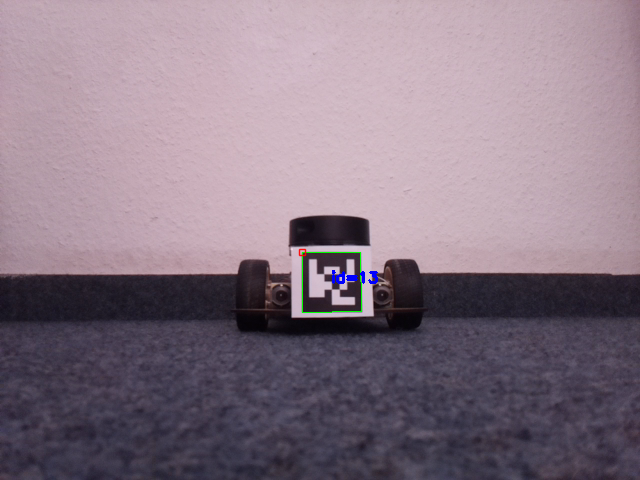
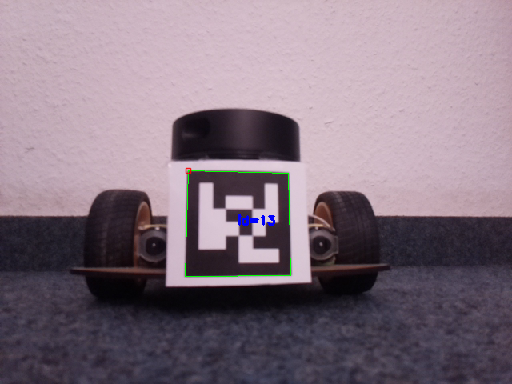
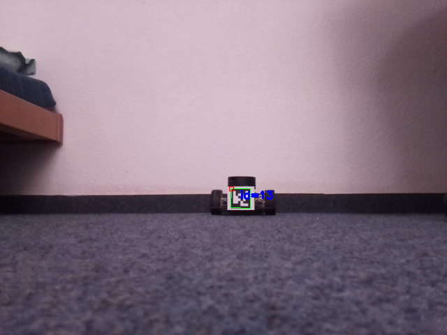
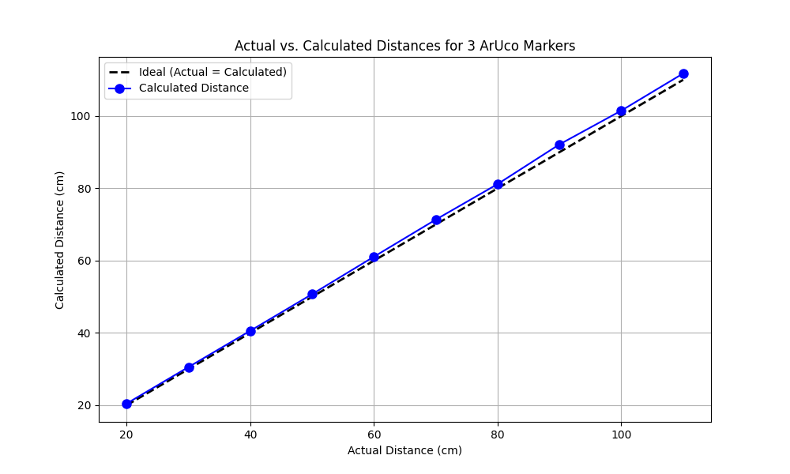

# Platooning Autonomous Following Robot

## Project Overview
The **Platooning Autonomous Following Robot** is designed to autonomously follow a lead vehicle, maintaining a safe distance using cost-effective hardware and advanced computer vision techniques. The project eliminates the need for expensive LiDAR systems by leveraging ArUco markers for tracking and navigation. Developed using Raspberry Pi 4 and OpenCV, the robot combines precise control algorithms with real-time camera processing to achieve reliable and scalable autonomous navigation.

---

## Objectives
- **Autonomous Following:** Enable the follower robot to track and follow a lead vehicle autonomously.
- **Cost-Effective Design:** Exclude expensive components like LiDAR to enhance scalability.
- **Safe and Reliable Operation:** Maintain consistent performance across diverse conditions.
- **Technology Integration:** Employ advanced computer vision, robotics, and control systems.

---

## Key Technologies and Components
- **ArUco Markers:** Used for visual positioning and tracking. 
- **Raspberry Pi 4:** Acts as the main processing unit. 
- **Computer Vision (OpenCV):** Handles marker detection and pose estimation.
- **DC Motors and Motor Controller:** Facilitate movement and precise navigation.
- **Kalman Filter:** Reduces noise for improved movement accuracy.

---

## Implementation Details
### Hardware Setup
The robot integrates the following components:
- **Raspberry Pi 4:** Processes data from sensors and executes control algorithms.
- **Camera Module:** Captures real-time visuals for marker detection.
- **DC Motors and Motor Shield:** Provides movement capabilities.
- **Power Sources:** A power bank for Raspberry Pi and a dedicated battery for motors.

### Software Environment
- **Operating System:** Raspbian GNU/Linux 11 (Bullseye).
- **Libraries:** OpenCV, GPIO Zero, and Python 3.
- **Algorithms:**
  - Camera calibration to correct lens distortions. 
  - Marker detection and pose estimation using OpenCV.
  - Control algorithms for autonomous navigation.

---

## Key Features
1. **Camera Calibration:** Uses a checkerboard pattern to estimate intrinsic and extrinsic camera parameters, ensuring precise image correction.

#### Calibration Setup

For calibration, we used a 100 mm by 100 mm Checkerboard pattern with squares of size 10 mm by 10 mm. The chessboard pattern is ideal for calibration because it provides well-defined corners that can be easily detected and used to compute the camera parameters.

#### Checkerboard Details

- Checkerboard Size: 100 mm by 100 mm.
-Square Size: 10 mm by 10 mm.
- Number of Inner Corners: The chessboard has 9 inner corners along each dimension (9 x 9).

Checkerboard Image:

#### Image Acquisition

To perform a robust calibration, images of the Checkerboard were captured from different angles and distances. By using images taken from various viewpoints, the calibration process becomes more robust against potential errors caused by noise, lighting variations, or lens distortions.

Images of distorted images (4 images side by side)

  
  
  
  

images of undistorted images (4 images side by side)

  
  
  
  

#### Camera Calibration Process

The camera calibration process was implemented using algorithms developed with guidance from the official OpenCV documentation and supplemented by a comprehensive YouTube tutorial.

- Intrinsic Matrix (K):

Extrinsic Parameters (R, T): The extrinsic parameters describe the rotation (R) and translation (T) of the camera relative to the world coordinate system. These parameters are crucial for mapping 3D world coordinates to 2D image coordinates:

[R∣T]= 
​
- Distortion Coefficients

The lens of the camera introduces distortions in the captured images, such as radial and tangential distortion. These distortions are corrected by applying the following distortion 
coefficients:

Radial Distortion (k1, k2, k3): Causes straight lines to appear curved.
Tangential Distortion (p1, p2): Results from the misalignment of the lens with the image sensor.

Here are the distortion coefficients obtained during calibration:

2. **Marker Detection:** Employs OpenCV’s ArUco library to identify and track markers.

#### Generating and Detecting ArUco Markers

##### Generating ArUco Markers using Python

ArUco markers can be generated using the OpenCV library in Python.

- aruco.getPredefinedDictionary(aruco.DICT_6X6_50) selects the 6x6 marker dictionary.
- marker_id = 13 specifies the marker ID.
- marker_size = 500 sets the size of the marker to 500 pixels.
- The aruco.generateImageMarker() method generates the marker, and cv2.imshow() displays it.

This method is ideal for generating and displaying multiple markers without the need to save them to files.

##### Generating ArUco Markers Online

ArUco markers can also be generated online without writing code. The University of Oxford provides an online tool that simplifies the process.

To generate markers online:

- Visit the ArUco Generator.
- Select the marker dictionary and ID.
- Set the marker and border sizes.
- Click "Generate" to create the marker, then download the image.

#### Image of aruco marker 6by6_100 id 13

#### Detection of ArUco Markers

- Marker Detection and Identification

The detection and identification of ArUco markers in real-time can be performed using the OpenCV library on a Raspberry Pi 4. 

Explanation:

- The camera calibration parameters (camera_matrix and dist_coeffs) are used to correct lens distortion and ensure accurate detection.
- The cv2.aruco.detectMarkers() function detects ArUco markers in each frame.
- The cv2.aruco.drawDetectedMarkers() method highlights the detected markers in the frame.
- The real-time video feed is displayed using cv2.imshow().

#### Camera Calibration Parameters

To accurately estimate the pose of detected ArUco markers, the intrinsic camera parameters must be known. These parameters include the camera matrix and distortion coefficients, which were obtained during the camera calibration process.

#### Estimating the Pose of Detected Markers

Once the markers are detected in the video frame, their pose (position and orientation) relative to the camera can be estimated using the cv2.solvePnP() function. This function computes the 3D position and orientation of the marker based on the 2D image coordinates of its corners.

Explanation:

marker_points_3d represents the 3D coordinates of the marker's corners, assuming the marker is flat and the camera is aligned with its plane.
cv2.solvePnP() calculates the rotation vector (rvecs) and translation vector (tvecs), which describe the marker's position and orientation relative to the camera.

here are detecting of aruco marker visuals

3 images side by side.

  
  
  

3. **Distance Estimation:** Calculates the distance of markers using pose estimation.

#### Overview
Depth estimation is the process of determining the distance between the camera and objects within a scene. When using ArUco markers, depth estimation enables us to calculate how far a detected marker is from the camera. The depth, or Z-component, can be directly inferred from the translation vector (tvec) obtained during pose estimation. This distance is crucial in applications such as robotics, augmented reality, and navigation systems

#### Calculate the Distance for a Single ArUco Marker

The following steps outline how to calculate the distance of a single ArUco marker:

- Marker Detection: The algorithm detects the ArUco marker using OpenCV’s detectMarkers function [15], identifying the marker’s corners and ID.
- Pose Estimation: After detection, the pose of the marker is estimated using estimatePoseSingleMarkers [15], which provides the rotation vector (rvec) and translation vector (tvec).
- Translation Vector (tvec): The translation vector has three components: tx, ty, and tz, representing the marker's position relative to the camera:
   tx: Horizontal distance (left/right) from the camera’s optical axis.
   ty: Vertical distance (up/down) from the camera’s optical axis.
   tz: Depth or distance from the camera (forward/backward).

def calculate_distance(tvec):
    distance_meters = tvec[0][0][2]
    distance_cm = distance_meters * 100
    return distance_cm

- Distance Calculation: The Z-component of the translation vector (tz) represents the depth from the camera to the marker. To convert this distance from meters to centimeters:

Distance (cm) = tz × 100

#### Calculate the Distance for Multiple ArUco Markers

In this project, three ArUco markers are placed on the rear of the leading robot to ensure continuous detection within the camera’s field of view (FOV), even during turns. The algorithm calculates the distance and centroid if one, two, or three markers are detected.

#### Marker Detection and Centroid Calculation

The script detects ArUco markers and filters for those with a specific ID (ID 13 in this case). For each valid marker, the center is calculated by averaging the x and y coordinates of two opposite corners. The centroid is determined by averaging the centers of all valid markers.

The following images show the distance from the camera’s center to one, two, and three ArUco markers.

(a) Distance calculation for a single ArUco marker.
(b) Distance calculation for two ArUco markers.
(c) Distance calculation for three ArUco markers.

3 images side by side showing distance of one, two and 3 aruco markers:

  
  
  

#### Evaluation of Distance Calculation Algorithm

#### Evaluation Metrics

To assess the accuracy of the distance calculation algorithm, the following metrics were used:

- Mean Absolute Error (MAE): Measures the average magnitude of errors.
- Root Mean Squared Error (RMSE): Gives more weight to larger errors.
- Error Percentage: Shows the relative error for each distance.

image of plot :

- Graphical Analysis

Figure shows a plot of actual distances versus calculated distances.

#### Analysis and Discussion

The results indicate that the algorithm shows an average error of less than 2 cm, suggesting high accuracy. The error percentage remains consistently low across different distances, and the algorithm performs well with minimal errors, which are within acceptable limits for real-world applications.

4. **Movement Control:** Adjusts motor speeds dynamically to maintain alignment and distance. and **Real-Time Processing:** Ensures smooth operation in varying environments.

#### Motor Control

The algorithm adjusts motor speeds and direction based on the calculated distance and deviation to follow the leading robot. These values are optimized for a specific surface, but slight adjustments may be needed when the surface changes. Standardization has been attempted, but testing and fine-tuning are necessary for each surface to ensure optimal performance.

#### Motor Control Function

The `control_robot()` function adjusts the robot’s motors based on the distance, desired distance, lateral deviation, correction factors, and predicted deviation. Based on these inputs, it determines how the robot’s motors should be adjusted.

#### Forward and Backward Movement

The robot moves forward if the distance exceeds the desired distance by more than 5 cm and moves backward if it falls short by more than 5 cm, with lateral corrections made as needed by adjusting motor speeds.

#### Stopping

If the robot is within 5 cm of the desired distance, the robot stops using `stop_motors()`.

#### Lateral Corrections

Lateral deviations greater than 10 pixels trigger left or right corrections by adjusting motor speeds accordingly.

#### Kalman Filter

To enhance the accuracy of the robot’s movement and the measurements obtained from the camera sensor, a Kalman Filter is implemented. The Kalman Filter is an algorithm that processes a series of noisy observations over time to produce estimates that are more accurate than those based solely on individual measurements.

- Purpose

In our system, the Kalman Filter helps refine the distance and lateral deviation measurements obtained from the camera. By filtering out noise and inconsistencies in the visual data, the Kalman Filter provides a more accurate estimate of the robot’s position and orientation relative to the ArUco markers.

- Kalman Filter Function

The function kalman_filter() takes the observed measurement, the predicted estimate, and their respective uncertainties as inputs. It then calculates the optimal estimate by weighting the prediction and the measurement according to their uncertainties.

- Integration with Motor Control

The refined distance and lateral deviation estimates provided by the Kalman Filter are used as inputs to the control_robot() function. This integration allows the robot to make more precise movements and corrections, leading to smoother and more accurate following behavior.

#### Handling Loss of Marker Visibility

To ensure continuous and accurate tracking, the algorithm includes a strategy for handling situations where the ArUco marker temporarily goes out of the camera’s field of view. This approach ensures that the robot maintains its direction and is prepared to continue tracking once the marker reappears.

- 
Initialization of Variables
The algorithm initializes several variables to manage the behavior when the marker is lost:

python
# Initialize variables for lost marker handling
marker_lost = False
last_lateral_deviation = 0
marker_lost_start_time = 0
rotation_duration = 0.5  # Approximate duration to rotate 20 degrees (adjust based on your robot)
rotation_completed = False

- marker_lost: A boolean flag indicating whether the marker is currently lost.
- last_lateral_deviation: Stores the last known lateral deviation to determine the direction of rotation when the marker is lost.
- marker_lost_start_time: Records the time when the marker was first detected as lost, used to manage the rotation duration.
- rotation_duration: Specifies the time duration for which the robot should rotate to achieve approximately 20 degrees of rotation. This value may need to be adjusted based on the specific robot’s movement characteristics.
- rotation_completed: A boolean flag indicating whether the rotation has been completed.
Last Known Deviation

When the marker is lost, the robot uses the last known lateral deviation to determine the direction in which it should rotate slightly. The robot executes a small, controlled rotation (approximately 20 degrees) in the direction of the last known deviation—right if the deviation was positive, left if it was negative.

#### Rotation Control

This rotation is executed for a short duration, calculated based on the robot’s movement characteristics. The robot then stops and waits for the marker to reappear.

Code Example for Rotation Control
# Perform a slight rotation based on the last known lateral deviation
if last_lateral_deviation > 0:
    logging.info("Slightly rotating to the right.")
    left_motor_forward(0.5)  # Increase speed on the left motor
    right_motor_backward(0.3)  # Decrease speed on the right motor
elif last_lateral_deviation < 0:
    logging.info("Slightly rotating to the left.")
    left_motor_backward(0.3)  # Decrease speed on the left motor
    right_motor_forward(0.5)  # Increase speed on the right motor
else:
    stop_motors()

- Timeout Mechanism

If the marker is not detected again within a pre-defined timeout period, the robot will stop its rotation and hold its position until the marker is detected again. This prevents unnecessary or continuous rotation.

- Seamless Transition Back to Normal Operation

Once the marker is detected again, the robot resumes its normal operation, using the Kalman Filter and motor control functions to follow the marker accurately. This handling mechanism ensures that the robot remains responsive and adaptive, even in situations where the marker is temporarily lost, improving the overall robustness of the tracking system
---

## Results and Evaluation
- **Testing Scenarios:** Conducted under diverse conditions, demonstrating the system’s robustness.
- **Accuracy:** Achieved an average error of less than 2 cm in distance estimation.
- **Reliability:** Performed consistently across different lighting and surface conditions.
- **Testing Video:** 

---

## Future Work
- Enhance detection algorithms to address marker occlusion.
- Improve scalability for multi-vehicle platooning.
- Incorporate additional sensors for complex navigation tasks.

---

## References
1. A. Smith, B. Johnson, and C. Lee, "Visual marker systems for autonomous convoy operations: A review," *Journal of Robotics and Autonomous Systems*, vol. 115, pp. 123–135, 2020.
2. D. Chen, Y. Zhang, and H. Wang, "Integrating lidar and vision for autonomous vehicle navigation," *IEEE Transactions on Intelligent Vehicles*, vol. 4, no. 3, pp. 456–467, 2019.
3. K. Patel, R. Gupta, and P. Sharma, "Cost-effective sensor integration and real-time data fusion for autonomous vehicles," *International Journal of Advanced Robotic Systems*, vol. 18, no. 4, pp. 678–689, 2021.
4. R. Müller and S. Behnke, "Stereo vision and monocular depth estimation for autonomous vehicle following," in *Proceedings of the IEEE Conference on Computer Vision and Pattern Recognition (CVPR)*, pp. 678–687, 2018.
5. A. Garcia, J. Soto, and J. Villanueva, "Overcoming occlusion and lighting challenges in visual marker systems for autonomous navigation," *Robotics and Autonomous Systems*, vol. 123, pp. 101–110, 2020.
6. Raspberry Pi Foundation, "Raspberry Pi 4," [Online]. Available: [Raspberry Pi](https://www.raspberrypi.org/products/raspberry-pi-4-model-b/). Accessed: 08-August-2024.
7. J. Feßler, "Motor shield schematic diagram," RWU Robot Car Racing Competition, November 2020. Email: fessler@rwu.de.
8. RWU Moodle Course, "Motor control algorithm," *Robot Car Racing Competition*, Accessed: 08-August-2024.
9. Raspberry Pi Foundation, "Getting started with PiCamera," [Online]. Available: [PiCamera Guide](https://projects.raspberrypi.org/en/projects/getting-started-with-picamera). Accessed: 16-August-2024.
10. A. Name, "PiCamera test algorithm," Python Script. Available from: [Repository Link](https://yourrepositorylink.com).
11. R. Hartley and A. Zisserman, *Multiple View Geometry in Computer Vision*, 2nd ed., Cambridge University Press, 2004.
12. R. Szeliski, *Computer Vision: Algorithms and Applications*, 1st ed., Springer, 2010.
13. OpenCV, "Camera calibration with OpenCV," [Online]. Available: [OpenCV Documentation](https://docs.opencv.org/4.x/dc/dbb/tutorial_py_calibration.html). Accessed: 16-August-2024.
14. N. Nielsen, "Camera calibration in less than 5 minutes with OpenCV," YouTube, Available: [YouTube Tutorial](https://www.youtube.com/watch?v=_-BTKiamRTg). Accessed: 16-August-2024.
15. OpenCV, "ArUco marker detection and generation," [Online]. Available: [OpenCV ArUco](https://docs.opencv.org/4.x/d5/dae/tutorial_aruco_detection.html). Accessed: 09-August-2024.
16. Stanford University, "Pinhole camera model illustration," [Online]. Available: [Lecture Material](https://web.stanford.edu/class/ee267/lectures/lecture1.pdf). Accessed: 20-August-2024.
17. C. J. Willmott and K. Matsuura, "Advantages of the mean absolute error (MAE) over the root mean square error (RMSE)," *Climate Research*, vol. 30, pp. 79–82, 2005.
18. T. Chai and R. Draxler, "Root mean square error (RMSE) or mean absolute error (MAE)? Arguments against avoiding RMSE in the literature," *Geoscientific Model Development*, vol. 7, no. 3, pp. 1247–1250, 2014.
19. G. Bradski, "The OpenCV library," *Dr. Dobb's Journal of Software Tools*, 2000.
20. S. Garrido-Jurado, R. Muñoz-Salinas, F. J. Madrid-Cuevas, and M. J. Marín-Jiménez, "Automatic generation and detection of highly reliable fiducial markers under occlusion," *Pattern Recognition*, vol. 47, no. 6, pp. 2280–2292, 2014.
21. C. Schlegel, M. Waibel, and R. Siegwart, "Fast and robust localization with arbitrary landmark relations," in *IEEE/RSJ International Conference on Intelligent Robots and Systems*, IEEE, pp. 2723–2728, 2004.
22. A. Krause and C. S. Ong, "Contextual Gaussian process bandit optimization," in *Advances in Neural Information Processing Systems*, vol. 20, pp. 19–24, 2008.
23. G. Welch and G. Bishop, "An introduction to the Kalman filter," University of North Carolina, Department of Computer Science, Tech. Rep., 1995.

---

## Authors
- **Vardhan Vinodbhai Mistry**
- **Jai Doshi**

## Guided by
- **Prof. Dr. Stefan Elser**